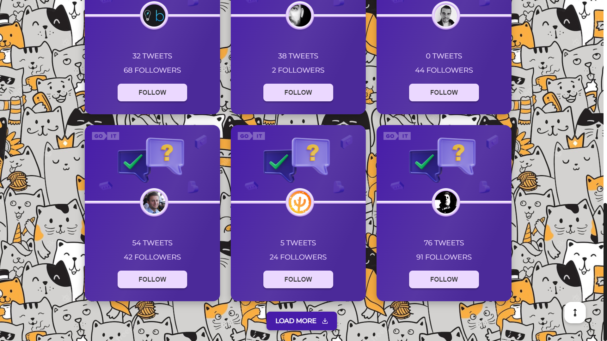

# Tweet App

## Preview

## Description

The "Tweets" App is a React.js-based single-page web application that
incorporates routing to facilitate seamless navigation across its pages.

The functionality of this app includes:

- The app provides an interactive experience when users click on the "Follow" button.
- The app allows for loading of additional users when users click on the "Load More" button.
- Clicking the "Back to Home Page" button enables users to return to the home page.
- Users can filter other users based on three distinct criteria.

## Technologies

- React
- React Router
- Redux (toolkit)
- JavaScript
- HTML
- CSS

## Additional technologies

This app also uses the Axios library to work with the server, which performs GET and POST requests.